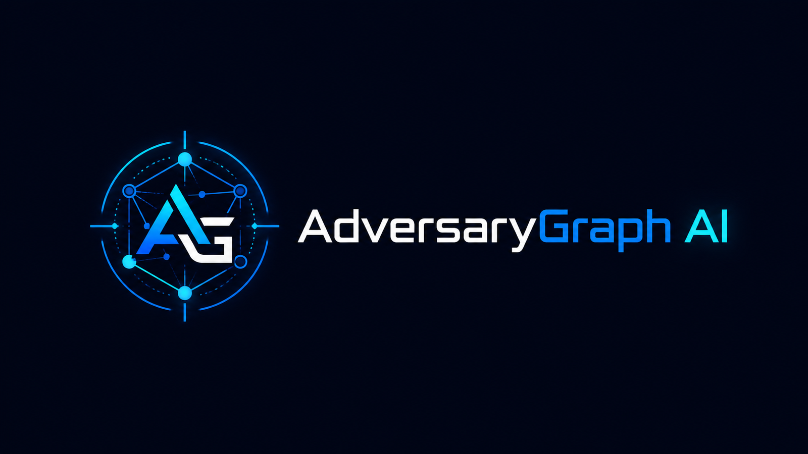

# AdversaryGraph



**Self-hosted AI-assisted CTI-to-detection workbench for ATT&CK mapping, hypothesis-driven threat hunting, Threat Radar early warning, Evidence-to-Detection Graph reasoning, IOC enrichment, CVE Library correlation, malware-analysis triage, asset attack-surface review, Attack Simulation, and SIEM validation.**

[](https://github.com/anpa1200/adversarygraph/actions/workflows/ci.yml)
[](VERSION)
[](SECURITY.md)
[](ROADMAP.md)
[](LICENSE)

Current release: **v6.5.0**. This release consolidates the complete post-v6
development line: hypothesis-driven Threat Hunting, multi-provider governed AI,
the Sigma/YARA-L Query Library, unified RAG and MCP, searchable saved-asset
intelligence and authorized exposure assessment, persistent SOC access groups,
module-level API/UI authorization across 31 workspaces, complete API contracts,
and hardened release/deployment controls. See the
[v6.5 release notes](docs/release-notes/v6.5.0.md),
[release summary](docs/release-summary-v6.5.0.md),
[release readiness guide](docs/release-readiness-v6.md),
[case studies](docs/case-studies-v6.md), and
[screenshot manifest](docs/assets/adversarygraph-v6/manifest.md).

The `v6.5.0` source metadata is the release candidate until the immutable tag
workflow builds, scans, publishes, and verifies its artifacts. The existing
`v6.0.0` tag remains the latest published historical release until that
workflow succeeds; its screenshots and artifact limitations apply only to that
tag and are not presented as v6.5 evidence.

## What It Does

AdversaryGraph helps analysts turn threat reports, IOC evidence, CVE vulnerability context, malware-analysis leads, asset inventories, and validation telemetry into reviewed ATT&CK/ATLAS mappings and detection engineering work items.

Core capabilities:

- AI-assisted report ingestion from text, PDF, DOCX, and TXT.
- Threat Radar for product-security CTI early warning: CVE/KEV/PoC/zero-day/supplier/package/hardware signals, product exposure scoring, case graphs, PSIRT/Hunt/IR/Detection workflows, a searchable saved-asset registry with evidence-labelled CVE/TTP/IOC detail pages, and inventory-bound asset assessment that combines passive OSINT, optional safe Nmap service discovery, bounded web posture checks, local CVE candidates, controlled discovery merging, and governed AI review.
- Threat Hunting for falsifiable hypotheses, bounded scope, ATT&CK mapping, telemetry requirements, versioned query plans, preserved findings, reviewed dispositions, auditable Threat Radar handoff, and governed multi-provider AI suggestions from stored reports or hunt context. Report-to-hunt AI supports Enterprise ATT&CK. The assistant can draft hypotheses, plans, queries, finding summaries, and outcome summaries, but it does not create evidence, execute a query, or make lifecycle and disposition decisions.
- Threat Hunting Query Library with reviewed Sigma/YARA-L examples, indexed
  community rules from bounded Git-backed feeds, fielded search and
  autocomplete, provenance and ATT&CK links, deterministic IOC-to-query
  generation across ten formats, and one-click creation of a canonical hunt
  draft.
- Unified hybrid RAG over normalized IOC, CVE, ATT&CK/TTP, actor, actor sector/region/technology observations, campaign, report, knowledge, Threat Radar signal, Threat Hunting, Evidence Graph, and sanitized asset records, with bounded one-hop expansion across allowlisted stored relationships, saved business profiles used as private request context, PostgreSQL full-text plus pgvector search, citation-bound AI answers, and expiring analyst-confirmed Navigator proposals. Relationship relevance remains an evidence-review lead, not proof of targeting or compromise.
- A bounded MCP server for authenticated read-only/advisory intelligence search, entity retrieval, grounded answers, and Navigator proposals without automatic platform mutation.
- ATT&CK/ATLAS Navigator with actor, campaign, sector, and comparison overlays.
- IOC Library, IOC Investigation pivots, VirusTotal lookup, and feed management.
- CVE Library with NVD and CISA KEV sync, CVSS score/CWE/CPE storage, and strict APT-TTP-IOC-CVE correlations.
- Asset Attack Surface Mapping from CMDB, scanner, cloud, CSV, JSON, and hostname/IP inventories, with strict `namespace:value` labels for products, suppliers, dependencies, technologies, sectors, CVEs, TTPs, risk, and exposure.
- Malware Analysis workflow backed by the isolated MalwareGraph service for static triage, strings, unpacking/deobfuscation support, debugger-style review, and AI summaries.
- Attack Simulation for TTP-first lab scenarios, real attacked-server telemetry, SIEM forwarding, coherent AI-assisted kill-chain drills, and attack-chain graph review.
- Evidence-to-Detection Graph for preserving the full reasoning chain from evidence to claims, behavior, ATT&CK, required telemetry, detection candidates, rules, validation scenarios, SIEM results, and analyst decisions.
- Observability dashboard with API request metrics, recent traces, redacted log tails, Prometheus-compatible metrics, and health/self-test views.
- Operations, Pipeline, detection backlog, investigation reports, exports, and API workflows.

## What It Is Not

AdversaryGraph is not a managed SaaS, not a multi-tenant security platform, and not a replacement for analyst validation. LLM mappings, RAG rankings and relationship expansion, AI answers, Navigator proposals, Threat Hunting AI suggestions, generated detections, actor similarity, malware-analysis findings, and synthetic SIEM telemetry are analyst-assistance outputs, not evidence or autonomous decisions. A retrieved relationship is not proof that an actor targets the selected business, an IOC is active, a CVE was exploited, or a compromise occurred.

Attack Simulation has two different telemetry modes:

- **Real lab telemetry:** produced by approved Docker lab fixtures such as `attack-lab-web` and `attack-lab-endpoint`.
- **Synthetic AI telemetry:** source-shaped events generated for SIEM parser/rule exercises. This validates field handling and correlation logic, not real exploit behavior.

See [Validation and Limitations](docs/validation-and-limitations.md), [Attack Simulation](docs/attack-simulation.md), and [SIEM forwarding security](docs/attack-simulation-siem-forwarding-security.md).

## Evidence-to-Detection Graph

AdversaryGraph preserves the full reasoning chain from raw evidence to validated
detection outcome:

```text
Evidence -> Claim -> Behavior -> ATT&CK Technique -> Required Telemetry
  -> Detection Candidate -> Detection Rule -> Validation Scenario
  -> SIEM Result -> Analyst Decision
```

This helps analysts see what is proven, what is inferred, what telemetry is
required, which detections exist, what has been validated, and what still needs
review. AI-generated graph nodes and edges are drafts until analyst-reviewed.
See [docs/evidence-to-detection-graph.md](docs/evidence-to-detection-graph.md).

## Quick Start

```bash
git clone https://github.com/anpa1200/adversarygraph.git
cd adversarygraph
cp .env.example .env
```

Edit `.env` and set strong local secrets. AI features are optional for the base
platform. To use them, configure an approved local OpenAI-compatible endpoint
or an operator-approved cloud provider as described in the relevant guide.

```bash
docker compose config --quiet
docker compose pull
docker compose up -d --build
./scripts/selftest.sh
```

This checkout is a source-build installation. Its custom
`adversarygraph-*:local-scan` images are built locally; `docker compose pull`
only refreshes pinned third-party runtime images and intentionally skips those
build targets. Do not replace the custom image variables with mutable `latest`
tags. A prebuilt production deployment requires all seven immutable image
digests from the exact release's `adversarygraph-images.env` attachment; the
historical `v6.0.0` release does not contain that complete artifact set.
Use the v6.5 manifest only after the v6.5 tag workflow publishes it.
The self-test waits up to fifteen minutes for first-boot ATT&CK/ATLAS reference
ingestion; override this with `SELFTEST_TIMEOUT` when operating across a slower
network.

Open:

- Frontend: `http://localhost:3000`
- API liveness: `http://localhost:3000/api/health`
- API readiness: `http://localhost:3000/api/ready`
- API docs: `http://localhost:3000/docs`

The default Compose deployment binds the public UI and reference docs to localhost and keeps the API, Redis, malware-analysis service, and lab fixtures on the internal Compose network.
Local configuration is stored in `.env`; the default persistent database is `${ADVERSARYGRAPH_DB_DIR:-./data/postgres}`. See [local storage and permissions](docs/local-storage-and-permissions.md) before deleting data directories or Docker volumes.

### Create named users and assign SOC access

For a private multi-user deployment, sign in as a Platform Administrator, open
**Admin Panel**, and create a named account:

1. Enter a unique username and optional display name.
2. Enter an initial password that satisfies the policy shown below the field
   (the default minimum is 12 characters).
3. Assign the smallest suitable SOC group; keep the advanced legacy role at
   `viewer` unless a compatibility requirement is documented.
4. Select **Create user**. The form reports missing fields and policy failures
   beside the action instead of silently disabling it.
5. Confirm the account appears in **Users and permissions**, then test sign-in
   and expected module access before enabling authentication for a deployment.

Browser/password-manager autofill is supported. If an upgraded browser still
shows the former disabled action, rebuild the frontend and perform a hard
refresh so it loads the current hashed assets. See
[Authentication and User Management](docs/authentication-and-users.md#create-a-named-user)
for API examples, error meanings, group policy, bootstrap sequencing, and
lockout prevention.

### Run a private local AI model

AdversaryGraph includes an optional Compose overlay for a private Ollama service.
It publishes no host or LAN port, persists models in the `ollama_models` volume,
and connects the API and workers over the internal Compose network. Set
`LOCAL_LLM_MODEL` in `.env`, then run:

```bash
make local-ai-up
```

The first run downloads the configured model and can take several minutes.
Open **Threat Hunting**, launch an AI assistant stage, and confirm the provider
shows **ready**. The provider endpoint also exposes safe operator diagnostics:

```bash
curl http://localhost:3000/api/threat-hunting/ai/providers | jq
```

The response distinguishes configuration, operator policy, and live local-model
readiness. A configured cloud credential remains unavailable to Threat Hunting
until `THREAT_HUNTING_AI_CLOUD_ENABLED=true`. An unsaved **Plan and scope** draft
may use an enabled remote provider only when the draft carries an explicit
eligible TLP marking and the analyst acknowledges remote processing for that
request. `TLP:AMBER+STRICT` and `TLP:RED` remain local-only, and later hunt
stages still require a saved hunt.

### Enable unified intelligence search

The unified RAG subsystem is enabled by default, but semantic embeddings are
off until an operator supplies a reviewed private embedding service. Exact-ID
and PostgreSQL full-text retrieval remain available without a model.

For an Ollama endpoint on the Docker host:

```bash
ollama pull nomic-embed-text
```

Back up PostgreSQL and review the [upgrade guide](docs/upgrade-guide.md) before
changing an existing deployment. Set these values in `.env`, then rebuild the
pgvector PostgreSQL image and the services that read or present RAG state:

```dotenv
LOCAL_LLM_BASE_URL=http://host.docker.internal:11434/v1
LOCAL_LLM_API_KEY=local
RAG_ENABLED=true
RAG_EMBEDDING_ENABLED=true
RAG_EMBEDDING_PROVIDER=local
RAG_EMBEDDING_MODEL=nomic-embed-text
RAG_EMBEDDING_DIMENSIONS=768
```

```bash
docker compose up -d --build postgres api worker beat frontend
```

Open **ATT&CK Navigator → AI RAG assistant** (dialog title: **Intelligence RAG
assistant**) and select **Build /
refresh RAG index**. An account needs `manage_feeds` to queue reconciliation;
search and assistance require `run_analysis`. Confirm `/api/rag/status` reports
a non-empty sanitized corpus before relying on assistant results. Changing the
embedding dimensions later requires a reviewed database migration and complete
reindex.

For example, create a profile with region **Israel**, sector **Technology**, and
the relevant technologies/crown jewels, then ask “Find IOCs relevant to this
business.” Review every cited record and warning. A second request such as
“Propose the relevant TTPs for Navigator” returns a temporary preview; applying
the verified IDs requires explicit Add/Replace confirmation and still does not
save a named layer.

The MCP integration is a separate, optional stdio process. It exposes four
bounded read-only/advisory tools and cannot confirm a proposal, save a layer,
reindex data, or execute a response action. See the [MCP server guide](docs/mcp-server.md)
for dedicated-account and client configuration.

## Documentation

| Need | Link |
|---|---|
| Commercial trust package | [Commercial Trust](https://1200km.com/adversarygraph-docs/commercial-trust/) |
| Architecture diagrams | [Architecture Diagrams](https://1200km.com/adversarygraph-docs/architecture/) |
| Case studies and validation examples | [Case Studies And Validation Examples](https://1200km.com/adversarygraph-docs/case-studies-validation/) |
| Comparison pages | [Comparison Overview](https://1200km.com/adversarygraph-docs/comparisons/overview/) |
| Reviewer orientation | [docs/reviewer-guide.md](docs/reviewer-guide.md) |
| v6.5 release notes | [docs/release-notes/v6.5.0.md](docs/release-notes/v6.5.0.md) |
| v6.5 release summary | [docs/release-summary-v6.5.0.md](docs/release-summary-v6.5.0.md) |
| Detailed module reference, examples, and case studies | [docs/module-reference.md](docs/module-reference.md) |
| Complete generated API reference | [docs/api-reference.md](docs/api-reference.md) |
| Version history | [docs/version-matrix.md](docs/version-matrix.md) |
| Complete v5 overview | [docs/v5-overview.md](docs/v5-overview.md) |
| v6 release readiness | [docs/release-readiness-v6.md](docs/release-readiness-v6.md) |
| v6 case studies | [docs/case-studies-v6.md](docs/case-studies-v6.md) |
| v6 screenshot evidence | [docs/assets/adversarygraph-v6/manifest.md](docs/assets/adversarygraph-v6/manifest.md) |
| ATT&CK/STIX data model | [docs/attack-data-model.md](docs/attack-data-model.md) |
| Threat Radar | [docs/threat-radar.md](docs/threat-radar.md) |
| Threat Hunting operational guide | [docs/threat-hunting-guide.md](docs/threat-hunting-guide.md) |
| Threat Hunting Query Library | [docs/query-library.md](docs/query-library.md) |
| Unified intelligence RAG and MCP | [docs/unified-rag-and-mcp.md](docs/unified-rag-and-mcp.md) |
| MCP server configuration | [docs/mcp-server.md](docs/mcp-server.md) |
| EMB3D embedded threat modeling | [docs/emb3d.md](docs/emb3d.md) |
| CVE Library | [docs/cve-cvss-intelligence.md](docs/cve-cvss-intelligence.md) |
| Evidence-to-Detection Graph | [docs/evidence-to-detection-graph.md](docs/evidence-to-detection-graph.md) |
| Security policy | [SECURITY.md](SECURITY.md) |
| Security threat model | [docs/security-threat-model.md](docs/security-threat-model.md) |
| Production readiness | [docs/production-readiness.md](docs/production-readiness.md) |
| Local storage and permissions | [docs/local-storage-and-permissions.md](docs/local-storage-and-permissions.md) |
| Hardened Docker Compose profile | [docker-compose.prod.yml](docker-compose.prod.yml) |
| Kubernetes Helm chart | [helm/adversarygraph/README.md](helm/adversarygraph/README.md) |
| Deployment sizing | [docs/deployment-sizing.md](docs/deployment-sizing.md) |
| Backup and restore | [docs/backup-restore.md](docs/backup-restore.md) |
| Upgrade guide | [docs/upgrade-guide.md](docs/upgrade-guide.md) |
| Validation and limitations | [docs/validation-and-limitations.md](docs/validation-and-limitations.md) |
| Public demo privacy | [docs/public-demo-privacy.md](docs/public-demo-privacy.md) |
| Platform guide | [docs/adversarygraph-platform-guide.md](docs/adversarygraph-platform-guide.md) |
| User guide | [docs/user-guide.md](docs/user-guide.md) |
| Research analysis guide | [docs/research-analysis-guide.md](docs/research-analysis-guide.md) |
| Admin guide | [docs/admin-guide.md](docs/admin-guide.md) |
| Authentication and user management | [docs/authentication-and-users.md](docs/authentication-and-users.md) |
| Observability and security validation | [docs/observability-security-validation.md](docs/observability-security-validation.md) |
| Attack Simulation | [docs/attack-simulation.md](docs/attack-simulation.md) |
| SIEM forwarding security | [docs/attack-simulation-siem-forwarding-security.md](docs/attack-simulation-siem-forwarding-security.md) |
| Asset Attack Surface Mapping | [docs/asset-attack-surface.md](docs/asset-attack-surface.md) |
| Taxonomy and Label Convention | [docs/taxonomy-and-label-convention.md](docs/taxonomy-and-label-convention.md) |
| Malware Analysis guide | [docs/malware-analysis-guide.md](docs/malware-analysis-guide.md) |
| Malware Analysis boundary | [docs/malware-analysis-boundary.md](docs/malware-analysis-boundary.md) |
| Demo dataset | [demo/README.md](demo/README.md) |
| Issue triage | [docs/issue-triage.md](docs/issue-triage.md) |

Official public pages:

- Project landing page: <https://1200km.com/adversarygraph/>
- Documentation: <https://1200km.com/adversarygraph-docs/>
- Live intelligence workspace: <https://1200km.com/threat-matrix/>
- Medium archive: <https://medium.com/@1200km>

## Architecture

```text
React frontend
  -> FastAPI API
     -> PostgreSQL + pgvector for authoritative records, normalized RAG documents,
        full-text indexes, vectors, proposals, analyses, cases, and operations
     -> Redis/Celery for background sync, RAG reconciliation/retention,
        feed collection, and RetroHunt jobs
     -> LLM providers selected by the operator
     -> MalwareGraph service for isolated malware-analysis workflows
     -> Attack lab fixtures for authorized simulation telemetry

Local MCP client
  -> stdio-only AdversaryGraph MCP process
     -> fixed governed RAG API routes
```

The main platform stores structured CTI and workflow data. Malware samples are handled by the MalwareGraph boundary. Attack Simulation lab targets are separate fixture containers so telemetry comes from the target class being tested.

## Safety Boundaries

- Do not upload confidential data to public demos.
- Do not expose the default Compose stack directly to the internet.
- Use TLS, authentication, restricted networks, backups, monitoring, and secret rotation for controlled production deployments.
- Native username/password login, persistent SOC groups, module-level API access, user management, and trusted reverse-proxy auth are documented in [Authentication and User Management](docs/authentication-and-users.md).
- Treat LLM output and generated detections as untrusted until reviewed.
- Threat Hunting AI defaults to the operator-configured local provider. Cloud use
  is disabled by default and requires operator enablement plus explicit analyst
  acknowledgment; `TLP:AMBER+STRICT` and `TLP:RED` inputs remain local-only.
- RAG embeddings accept only the configured local provider, and its
  OpenAI-compatible endpoint must use a loopback, private/link-local IP, or
  recognized private service DNS host. Public endpoints cannot be relabeled as
  `local`.
- Connect RAG reconciliation workers directly to PostgreSQL or through
  PgBouncer in session-pooling mode. Transaction or statement pooling is not
  compatible with the worker's session advisory lock.
- Treat vectors, source excerpts, saved business profiles, assistant records,
  and MCP tool results as sensitive derived data under the source records'
  handling requirements. The default purge windows are 30 days for inactive
  corpus tombstones and 90 days for assistance records; a zero value disables
  that automatic purge for operator-controlled legal hold.
- Run MCP through stdio with a dedicated least-privilege analyst session. The
  current session token is not independently scoped, and the MCP process does
  not provide a remote HTTP transport or OAuth boundary.
- Use only approved lab targets for Attack Simulation.
- Keep malware runtime execution in disposable isolated profiles only.

## Validation

Local validation commands:

```bash
./scripts/release-readiness.sh --full
```

CI runs backend tests, backend lint, backend SAST, backend dependency audit,
frontend build and dependency audit, the Anomaly Detection Atlas documentation
build and dependency audit, Docker Compose and Helm validation, Docker image
builds, container scanning, secret scanning, and version consistency checks.
The automated gate does not prove that a deployment-specific private embedding
or chat endpoint is reachable or produces acceptable intelligence. Before a
production rollout, reconcile a representative corpus and perform a cited
search, a governed assistant query, a Navigator preview/confirmation check, and
an MCP stdio smoke test in the target environment.

## License

Personal-use license. See [LICENSE](LICENSE).
