# AdversaryGraph Usecases.

# 30 Practical AdversaryGraph Use Cases

AdversaryGraph is a self-hosted AI CTI and detection engineering platform for analysts who need to move from raw intelligence to reviewed action. It connects report analysis, log and PCAP triage, IOC enrichment, actor context, MITRE ATT&CK mapping, feed synchronization, matrix visualization, detection generation, and exportable evidence in one workflow.

The main idea is simple: an analyst should be able to take a report, IOC, log excerpt, PCAP, actor name, sector requirement, or detection gap and turn it into something operational. That output can be a reviewed ATT&CK layer, an IOC enrichment record, an actor comparison, a customer-ready investigation report, a coverage backlog, or a draft Sigma/YARA/YARA-L detection.

Relevant links:

- GitHub repository: https://github.com/anpa1200/adversarygraph
- Official documentation: https://1200km.com/adversarygraph-docs/
- Getting started guide: https://1200km.com/adversarygraph-docs/getting-started/
- Capabilities overview: https://1200km.com/adversarygraph-docs/capabilities/
- Public project page: https://1200km.com/adversarygraph/
- 1200km research ecosystem: https://1200km.com/
- Medium publication: https://medium.com/@1200km
- Published From Log to Report walkthrough: https://medium.com/@1200km/from-log-to-report-using-adversarygraph-eff2e1d8f2cd

This article is not a generic feature list. It is a practical use-case map for the platform. Each use case starts from a real analyst situation, shows where to begin in AdversaryGraph, and defines the expected output. You can read it from top to bottom, but it is more useful as a workflow menu:

- SOC analysts can start with IOC lookup, log/PCAP triage, enrichment, and actor comparison.
- CTI analysts can start with report-to-ATT&CK mapping, actor profiles, sector intelligence, and campaign comparison.
- Detection engineers can start with Navigator layers, coverage gaps, rule feeds, and AI-assisted detection generation.
- Consultants and customer-facing analysts can start with investigation reports, executive coverage summaries, and evidence-backed exports.
- Platform operators can start with selftest, feed management, TAXII/STIX, MISP, custom feeds, and troubleshooting.

This article collects 30 practical ways to use the platform. The first 10 are simple daily actions, the next 10 are structured analyst workflows, and the final 10 are full investigation and defense workflows.

The value of these use cases is that they show how the platform pieces connect. AdversaryGraph is strongest when it is used as a workflow system, not as isolated pages. For example, an IOC lookup can become a VirusTotal enrichment, which can become mapped TTPs, which can become a Navigator comparison layer, which can become a detection backlog and a report. A vendor article can become accepted or rejected TTP evidence, actor similarity hypotheses, enriched IOCs, and a customer-ready PDF. A sector question can become a prioritized actor/TTP list for a specific customer environment.

Use this article as a checklist when demonstrating, testing, documenting, or improving the platform. If a workflow is important to your team, it should be possible to trace it through one of these use cases from input to reviewed output.

## Table Of Contents

- [Usecase number "1" - Check One IOC](#usecase-number-1---check-one-ioc)
- [Usecase number "2" - Open One Actor Profile](#usecase-number-2---open-one-actor-profile)
- [Usecase number "3" - Show Actor TTPs On The Matrix](#usecase-number-3---show-actor-ttps-on-the-matrix)
- [Usecase number "4" - Search The IOC Library](#usecase-number-4---search-the-ioc-library)
- [Usecase number "5" - Sync ThreatFox IOCs](#usecase-number-5---sync-threatfox-iocs)
- [Usecase number "6" - Import A Navigator Layer](#usecase-number-6---import-a-navigator-layer)
- [Usecase number "7" - Export A PDF Report](#usecase-number-7---export-a-pdf-report)
- [Usecase number "8" - Run Deployment Selftest](#usecase-number-8---run-deployment-selftest)
- [Usecase number "9" - Add A Custom IOC Feed](#usecase-number-9---add-a-custom-ioc-feed)
- [Usecase number "10" - Open Troubleshooting For An Error](#usecase-number-10---open-troubleshooting-for-an-error)
- [Usecase number "11" - Map A Report To ATT&CK](#usecase-number-11---map-a-report-to-attck)
- [Usecase number "12" - Compare Incident TTPs To Actors](#usecase-number-12---compare-incident-ttps-to-actors)
- [Usecase number "13" - Build A Sector Threat Brief](#usecase-number-13---build-a-sector-threat-brief)
- [Usecase number "14" - Enrich Actor IOCs](#usecase-number-14---enrich-actor-iocs)
- [Usecase number "15" - Import MISP JSON](#usecase-number-15---import-misp-json)
- [Usecase number "16" - Pull TAXII Or Import STIX](#usecase-number-16---pull-taxii-or-import-stix)
- [Usecase number "17" - Sync YARA, YARA-L, And Sigma Feeds](#usecase-number-17---sync-yara-yara-l-and-sigma-feeds)
- [Usecase number "18" - Compare Two Reports](#usecase-number-18---compare-two-reports)
- [Usecase number "19" - Review One Coverage Gap](#usecase-number-19---review-one-coverage-gap)
- [Usecase number "20" - Use A Local LLM For Private Reports](#usecase-number-20---use-a-local-llm-for-private-reports)
- [Usecase number "21" - Investigation: From Log To Report](#usecase-number-21---investigation-from-log-to-report)
- [Usecase number "22" - Investigation: Cloud And Kubernetes Incident](#usecase-number-22---investigation-cloud-and-kubernetes-incident)
- [Usecase number "23" - Investigation: Cluster Multiple APT Reports](#usecase-number-23---investigation-cluster-multiple-apt-reports)
- [Usecase number "24" - Investigation: Malware Family Behavior Mapping](#usecase-number-24---investigation-malware-family-behavior-mapping)
- [Usecase number "25" - Investigation: Validate A Third-Party CTI Report](#usecase-number-25---investigation-validate-a-third-party-cti-report)
- [Usecase number "26" - Defense: Build MITRE Coverage Baseline](#usecase-number-26---defense-build-mitre-coverage-baseline)
- [Usecase number "27" - Defense: Create Sector-Based Detection Roadmap](#usecase-number-27---defense-create-sector-based-detection-roadmap)
- [Usecase number "28" - Defense: Build IOC Enrichment Pipeline](#usecase-number-28---defense-build-ioc-enrichment-pipeline)
- [Usecase number "29" - Defense: Create Detection Content From CTI](#usecase-number-29---defense-create-detection-content-from-cti)
- [Usecase number "30" - Defense: Executive Risk And Coverage Report](#usecase-number-30---defense-executive-risk-and-coverage-report)
- [Common Review Standard](#common-review-standard)

## Simple Use Cases

### Usecase number "1" - Check One IOC

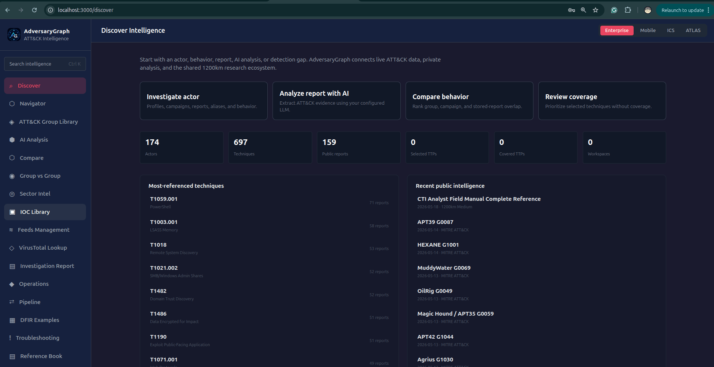

**Scenario:** SOC triage receives a single IP, domain, URL, or hash from an EDR alert, firewall log, phishing ticket, or customer report.

**Flow:** Open IOC Library or VirusTotal Lookup, paste the indicator, and open Enrichment. Review reputation, source labels, timestamps, malware family, actor hints, and mapped TTPs.

**Output:** A short IOC decision record that supports escalation, hunting, blocking, or closure.

### Usecase number "2" - Open One Actor Profile

**Scenario:** A customer asks whether a named actor in a report is relevant to their environment or sector.

**Flow:** Open ATT&CK Group Library, search by actor name, ATT&CK ID, or alias, then review aliases, description, last activity, sectors, TTPs, reports, and IOC availability.

**Output:** A reviewed actor context note with aliases, known techniques, evidence links, and relevance comments.

### Usecase number "3" - Show Actor TTPs On The Matrix

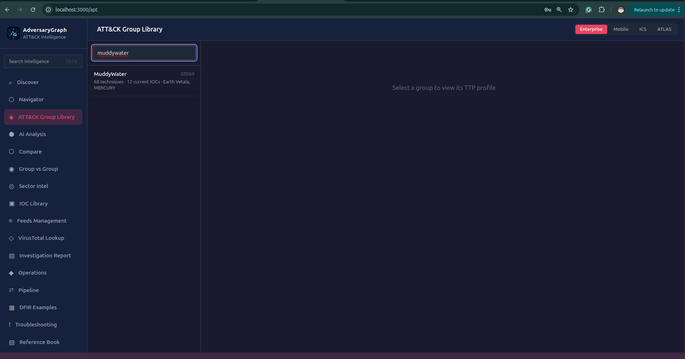

**Scenario:** A detection engineer needs a quick visual view of one actor behavior before planning coverage work.

**Flow:** Open the actor profile and click Show on matrix or Overlay on Navigator.

**Output:** An ATT&CK matrix view showing the actor technique set for fast coverage review.

### Usecase number "4" - Search The IOC Library

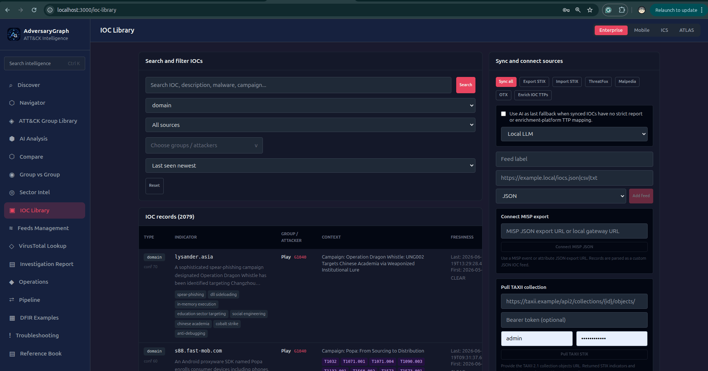

**Scenario:** A SOC analyst wants to know whether an indicator has already appeared in local or synchronized intelligence.

**Flow:** Open IOC Library and search by indicator value, malware family, campaign, source, type, or actor.

**Output:** A filtered IOC result with source, first seen, last seen, type, mapped actor, mapped TTPs, and enrichment entry point.

### Usecase number "5" - Sync ThreatFox IOCs

**Scenario:** The local IOC library needs current malware infrastructure before the team starts daily triage.

**Flow:** Open Feeds Management, run ThreatFox sync, and review imported or updated IOC counts.

**Output:** Updated IOC records with source attribution, malware context, timestamps, and actor links where available.

### Usecase number "6" - Import A Navigator Layer

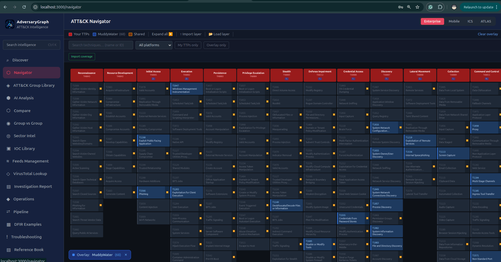

**Scenario:** A team already has an ATT&CK Navigator layer from a previous assessment or another tool.

**Flow:** Open Navigator, import the layer, and compare it against current actor, sector, or report-derived TTPs.

**Output:** Imported ATT&CK coverage that can be reused inside the AdversaryGraph workflow.

### Usecase number "7" - Export A PDF Report

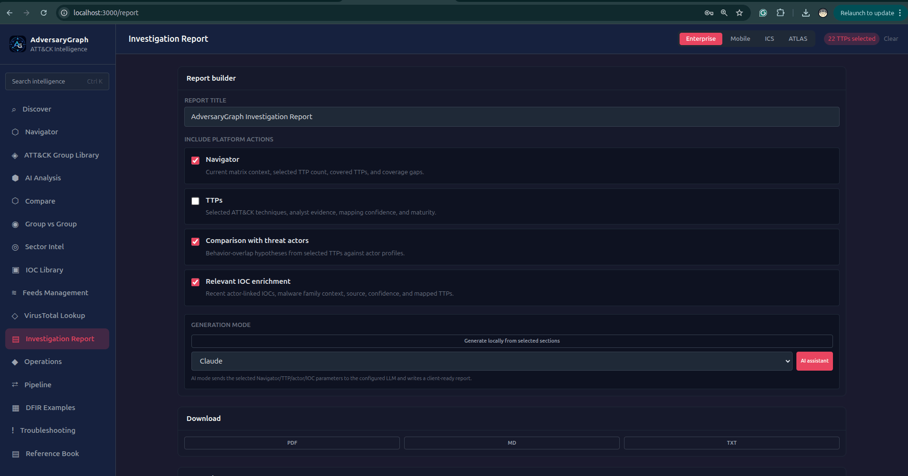

**Scenario:** A customer or manager needs a clean summary of reviewed investigation output.

**Flow:** Open the investigation or report view and export reviewed findings as PDF.

**Output:** A shareable PDF containing reviewed TTPs, IOCs, actor context, evidence, and analyst notes.

### Usecase number "8" - Run Deployment Selftest

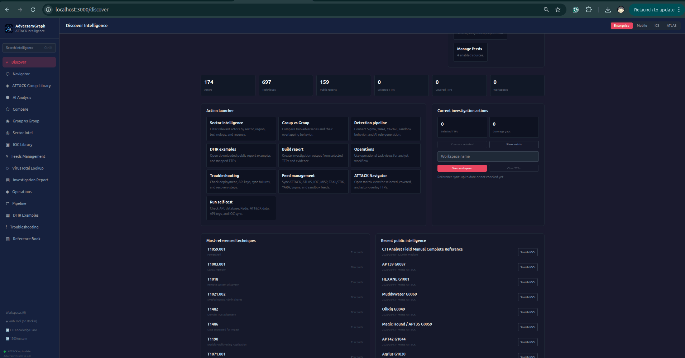

**Scenario:** A new Docker deployment starts, but the analyst needs to know whether API keys, database, and sync services are ready.

**Flow:** Open the selftest popup or Troubleshooting page, click Recheck, and review failed checks if any.

**Output:** A clear system status message showing whether API, DB, keys, sync, and frontend connectivity are healthy.

### Usecase number "9" - Add A Custom IOC Feed

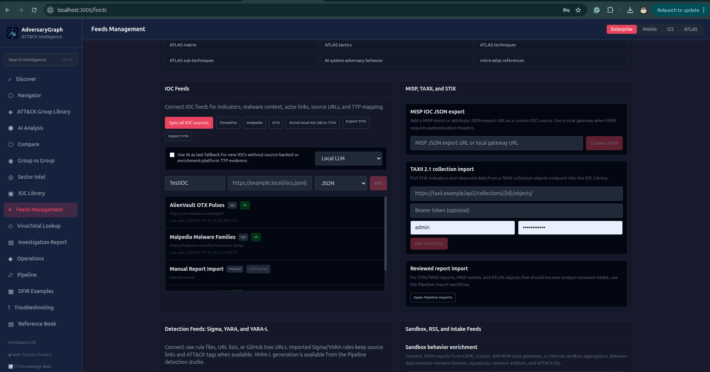

**Scenario:** A private customer or internal team publishes a JSON, CSV, or TXT feed that must stay inside the local environment.

**Flow:** Open Feeds Management, add the feed label, URL, format, and sync it.

**Output:** A reusable custom feed source with imported indicators linked to the local IOC Library.

### Usecase number "10" - Open Troubleshooting For An Error

**Scenario:** An analyst sees an API error, missing key warning, failed sync, or failed enrichment request.

**Flow:** Click Open troubleshooting from the error popup, follow the matching checklist, and run Recheck.

**Output:** A clear remediation path and a green All correct message after the issue is fixed.

## Intermediate Use Cases

### Usecase number "11" - Map A Report To ATT&CK

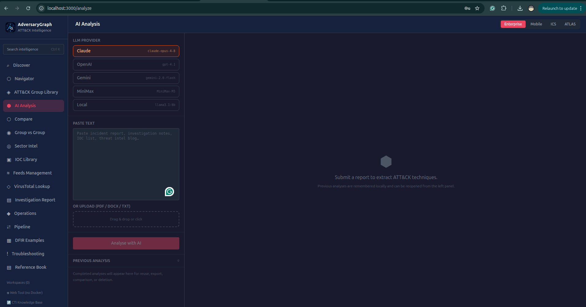

**Scenario:** A CTI analyst receives a vendor report or incident write-up and needs to convert narrative text into ATT&CK evidence.

**Flow:** Open AI Analysis or Investigation Report, paste or upload the report, run analysis with the configured LLM provider, then review extracted TTPs as accepted, rejected, suggested, or needs-evidence.

**Output:** A reviewed ATT&CK mapping with evidence snippets and analyst status for each technique.

### Usecase number "12" - Compare Incident TTPs To Actors

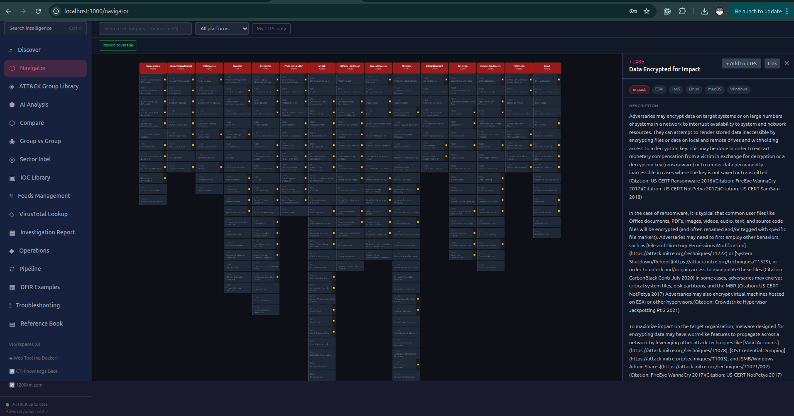

**Scenario:** An incident shows a known set of behaviors, but attribution is not clear.

**Flow:** Load accepted incident TTPs, open Compare or Group vs Group, review overlapping actors and missing behaviors, then document hypotheses with confidence notes.

**Output:** A ranked actor similarity view with evidence-based hypotheses and caveats.

### Usecase number "13" - Build A Sector Threat Brief

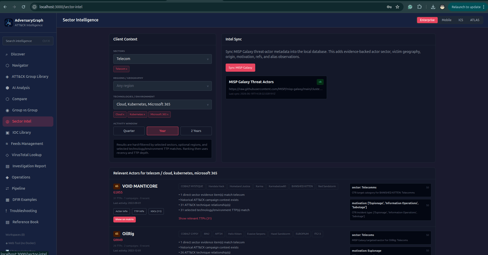

**Scenario:** A telecom, cloud, finance, healthcare, or industrial customer asks which actors are most relevant now.

**Flow:** Open Sector Intel, choose one or more sectors, regions, and technologies, set the activity window, then open top actors and export key TTPs.

**Output:** A sector-specific threat brief with relevant actors, recent activity, and priority TTPs.

### Usecase number "14" - Enrich Actor IOCs

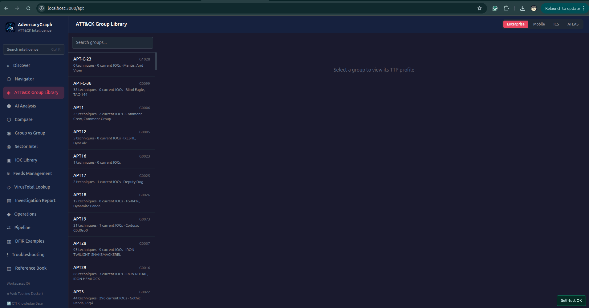

**Scenario:** An actor profile has only partial IOC coverage and the analyst needs current infrastructure context.

**Flow:** Open the actor IOC tab, sync ThreatFox, OTX, MalwareBazaar, Malpedia, or custom feeds, then open IOC Enrichment for high-value values.

**Output:** An enriched actor IOC view with source labels, malware family context, TTP hints, and review state.

### Usecase number "15" - Import MISP JSON

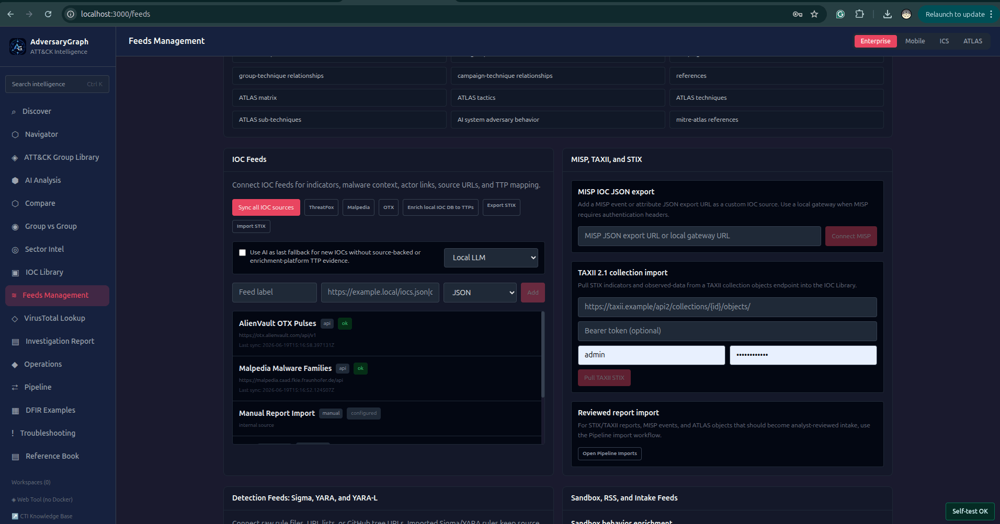

**Scenario:** A partner shares a MISP event or attribute export that needs to be used inside the local investigation workflow.

**Flow:** Open Feeds Management or IOC Library, paste the MISP JSON export URL or local gateway URL, import, and filter values by source and actor.

**Output:** MISP-backed indicators stored in the IOC Library with source and context preserved.

### Usecase number "16" - Pull TAXII Or Import STIX

**Scenario:** A team receives STIX/TAXII intelligence from a sharing community or internal platform.

**Flow:** Open Feeds Management, add TAXII collection URL, token, or basic auth, pull STIX objects, and review imported indicators.

**Output:** A synchronized TAXII/STIX feed represented in the IOC Library and CTI workflow.

### Usecase number "17" - Sync YARA, YARA-L, And Sigma Feeds

**Scenario:** Detection engineers need current public and private rule sources available while building detections.

**Flow:** Open Feeds Management, connect Sigma, YARA, YARA-L, and custom rule sources, run rule sync, then use Pipeline detection generation.

**Output:** Rule feeds available as references for detection review and AI-assisted generation.

### Usecase number "18" - Compare Two Reports

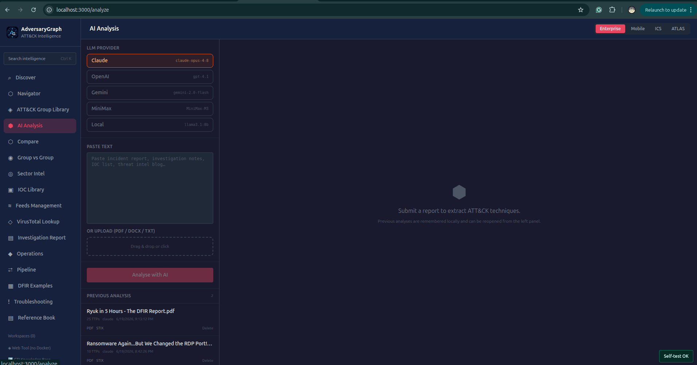

**Scenario:** Two reports may describe related campaigns but use different names, IOCs, and writing styles.

**Flow:** Analyze both reports, accept or reject extracted TTPs, open Compare, and review shared and unique techniques, IOCs, and actor hints.

**Output:** A comparison record showing overlap, divergence, and next investigation pivots.

### Usecase number "19" - Review One Coverage Gap

**Scenario:** A SOC manager asks whether a specific ATT&CK technique is covered by current detections.

**Flow:** Open Navigator or coverage view, select the technique, review actor/report usage evidence, then generate or draft detection logic.

**Output:** A coverage-gap note with evidence, affected actors, rule draft, and review status.

### Usecase number "20" - Use A Local LLM For Private Reports

**Scenario:** A sensitive incident report cannot be sent to external AI providers.

**Flow:** Configure the local LLM provider, open AI Analysis, select local provider and model, then analyze the report and review extracted TTPs.

**Output:** Private report analysis output generated through the local LLM path.

## Complex Investigation Use Cases

### Usecase number "21" - Investigation: From Log To Report

**Scenario:** A SOC receives firewall logs showing repeated outbound connections from one workstation and EDR logs showing Office-spawned PowerShell, unsigned payloads, discovery commands, `rundll32`, WMI, and possible C2 infrastructure.

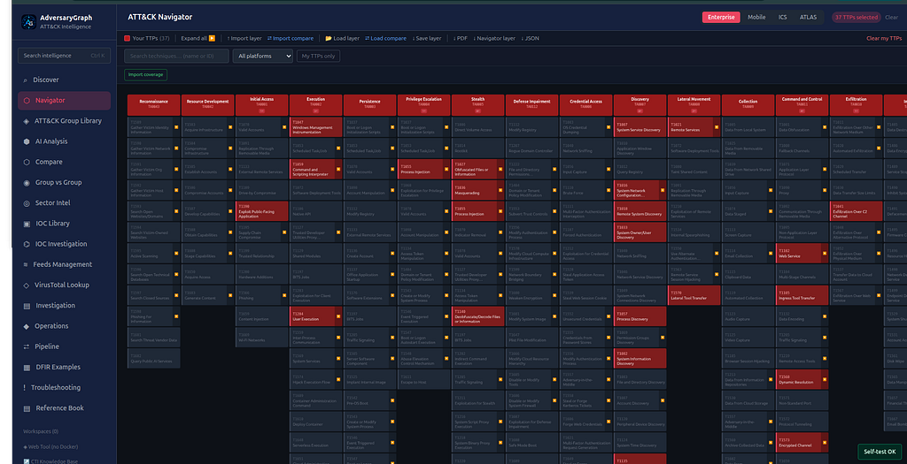

**Flow:** Create a new investigation, analyze firewall logs, add the result to the case, analyze EDR logs separately, add the result to the same case, review extracted IOCs and suspicious behaviors, investigate high-value IOCs, review relationship graph pivots, build a TTP layer, compare with actor profiles, generate an AI investigation summary, and export the final report.

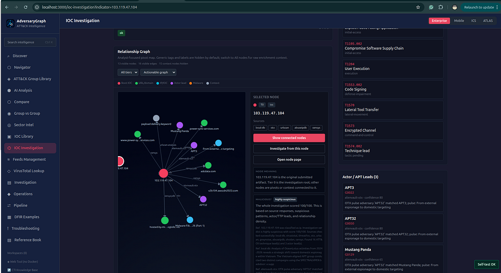

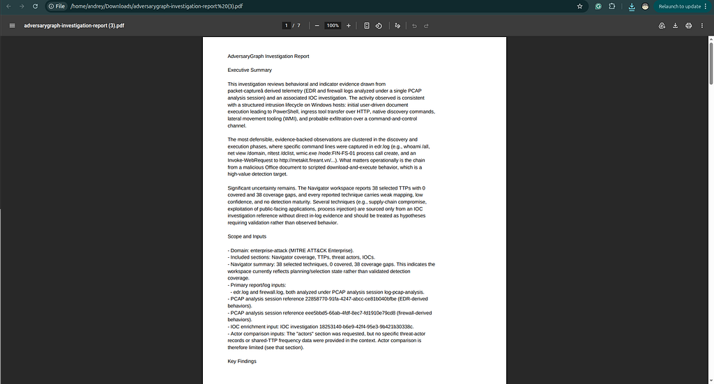

**Output:** A complete log-to-report investigation package with source-tagged IOCs, suspicious behaviors, ATT&CK TTP evidence, IOC enrichment, graph relationships, actor comparison leads, an AI summary, and an exportable client-ready report.

**Full walkthrough:** https://medium.com/@1200km/from-log-to-report-using-adversarygraph-eff2e1d8f2cd

### Usecase number "22" - Investigation: Cloud And Kubernetes Incident

**Scenario:** A cloud customer reports suspicious service account activity, container execution, and unusual outbound connections.

**Flow:** Collect cloud logs and Kubernetes audit snippets, analyze the report text, filter Sector Intel by cloud and Kubernetes technology, map extracted TTPs, enrich domains and IPs, compare against cloud-focused actor profiles, and generate KQL or Sigma drafts.

**Output:** A cloud incident workup with TTP mapping, IOC enrichment, actor relevance, and cloud-focused detection backlog.

### Usecase number "23" - Investigation: Cluster Multiple APT Reports

**Scenario:** Several vendor reports mention similar actors, aliases, malware, and infrastructure but use inconsistent names.

**Flow:** Import reports, extract TTPs and IOCs, normalize actor aliases, compare reports by campaign, review shared techniques, open related actor pages, and export matrix and evidence tables.

**Output:** A campaign-clustering package that separates strong evidence from weak similarity.

### Usecase number "24" - Investigation: Malware Family Behavior Mapping

**Scenario:** A malware family appears in multiple feeds and reports, but defenders need behavior rather than only hashes.

**Flow:** Search IOC Library by malware family, open enrichment for representative indicators, pull sandbox behavior, map behavior tags and report evidence to TTPs, then generate YARA, YARA-L, or Sigma drafts.

**Output:** A malware behavior profile with source-backed TTPs, enriched IOCs, and detection drafts.

### Usecase number "25" - Investigation: Validate A Third-Party CTI Report

**Scenario:** A customer sends an external CTI report and asks whether it is actionable for their sector.

**Flow:** Upload the report, extract TTPs and IOCs, enrich all indicators, compare with actor profiles and sector filters, reject unsupported mappings, mark uncertain mappings as needs-evidence, and create a validation summary.

**Output:** A validated CTI report summary with accepted findings, rejected claims, evidence gaps, and recommended actions.

## Complex Defense Use Cases

### Usecase number "26" - Defense: Build MITRE Coverage Baseline

**Scenario:** A detection team needs to know which ATT&CK techniques are covered before planning new engineering work.

**Flow:** Sync ATT&CK Enterprise, Mobile, ICS, and ATLAS where relevant, import current coverage layer, select relevant sectors and actors, overlay actor TTPs, identify uncovered techniques, and generate backlog.

**Output:** A baseline coverage map with prioritized missing techniques and supporting actor evidence.

### Usecase number "27" - Defense: Create Sector-Based Detection Roadmap

**Scenario:** A customer needs a practical roadmap for their sector and technology environment, not a generic ATT&CK checklist.

**Flow:** Open Sector Intel, select sectors, regions, technologies, and activity window, review ranked actors, show relevant TTPs on matrix, group gaps by telemetry source and detection format, and generate roadmap phases.

**Output:** A customer-specific detection roadmap tied to actors, sector evidence, and ATT&CK coverage.

### Usecase number "28" - Defense: Build IOC Enrichment Pipeline

**Scenario:** A SOC wants daily enrichment of IOCs from public, partner, and private sources.

**Flow:** Configure external database storage, connect ThreatFox, OTX, MalwareBazaar, Malpedia, MISP, TAXII/STIX, sandbox, and custom feeds, run sync, enrich new indicators by source priority, map IOCs to actors and TTPs, and export CSV or STIX when needed.

**Output:** A repeatable IOC enrichment pipeline with source attribution, mapped TTPs, actors, and update history.

### Usecase number "29" - Defense: Create Detection Content From CTI

**Scenario:** The detection team has CTI reports but needs usable rules for SIEM and malware tooling.

**Flow:** Analyze the source report, accept supported TTPs, open Pipeline detection generation, choose Sigma, YARA, YARA-L, KQL, SPL, or EQL, select AI provider or local model, generate rule draft, validate syntax, and attach analyst notes.

**Output:** Detection-rule handoff artifacts with CTI evidence, review status, and generated rule formats.

### Usecase number "30" - Defense: Executive Risk And Coverage Report

**Scenario:** Leadership asks which threats matter to the business and where defensive investment should go next.

**Flow:** Select sector, region, and technology filters, review ranked actors and activity windows, overlay relevant TTPs, summarize current coverage and gaps, group recommendations by business impact, and export a PDF report.

**Output:** An executive report that connects current threat relevance to measurable defensive coverage and priorities.

## Common Review Standard

- Preserve source labels and timestamps for every finding.
- Mark weak or incomplete evidence as `needs-evidence` instead of forcing a conclusion.
- Treat actor similarity as a hypothesis, not attribution.
- Prefer source-backed report evidence first, enrichment-platform evidence second, and AI enrichment only as reviewed support.
- Export only findings that have been reviewed by an analyst.

## Public Links

- Project: https://github.com/anpa1200/adversarygraph
- Documentation: https://1200km.com/adversarygraph-docs/
- Public use-case page: https://1200km.com/adversarygraph/use-cases.html
